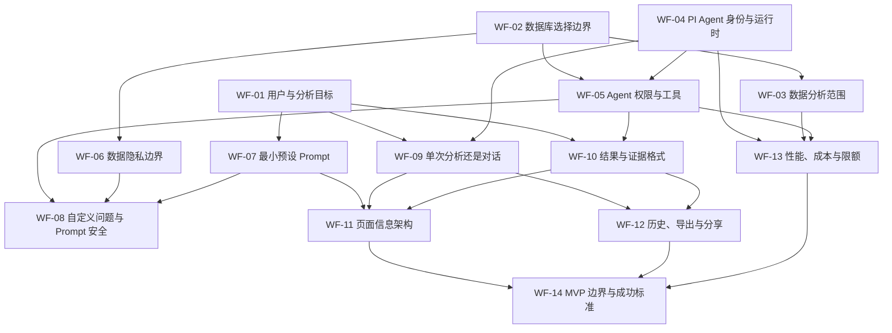

# Wayfinder 决策地图：PI Agent SQLite 数据分析

> 本文档是决策地图，不是实现任务清单。每个票据都应通过讨论、原型或调研得到一个明确决定；所有关键票据关闭后，再将结论整理为 Feature Spec 和实施任务。

## 地图元数据

- **地图编号**：`WF-PI-SQLITE-001`
- **状态**：草案，等待逐项决策
- **创建日期**：2026-08-15
- **目标产品**：CrawlCBG
- **建议页面名称**：PI 数据分析
- **建议路由**：`/pi-agent`
- **决策负责人**：待指定

## Destination

当这张地图完成时，团队已经明确：如何在 CrawlCBG 中增加一个 PI Agent 数据分析入口，让用户选择受支持的 SQLite 数据库中的一张或多张表，选择预设 Prompt 或输入自定义 Prompt，由服务端在 Agent 启动前将所选表的全量内容作为输入交给 Agent，并输出基于这些内容的分析结果。

地图完成后应足以回答以下问题：

1. 用户究竟在解决什么分析问题？
2. “选择数据库”的产品和安全边界是什么？
3. PI Agent 指哪个运行时，它可以使用哪些工具？
4. Prompt、数据和模型之间的安全边界是什么？
5. 页面如何组织，分析过程和结果如何呈现？
6. MVP 包含什么、不包含什么，如何判断它有价值？

## 用户已经明确的约束

以下内容来自原始需求，可视为地图的已知起点：

- [x] 在现有产品中增加一个菜单入口。
- [x] 引入 PI Agent。
- [x] Agent 的主要职责是分析 SQLite 中的数据。
- [x] 页面需要提供预设 Prompt 列表。
- [x] 用户需要选择要分析的数据库。
- [x] 单次分析由用户选择当前数据库中的一张或多张表。
- [x] 服务端在 PI Agent 启动前将所选表的 schema 和全量内容连同 Prompt 一次性传入。
- [x] Agent 不直接访问 SQLite，也不能读取未选择的表。
- [x] `tab_schedules`、`tab_schedule_runs` 等内部表不向 Agent 开放。
- [x] 用户选择的爬取数据及其派生内容不是机密内容，允许发送给任意外部模型或第三方服务，不脱敏、不限制目标。
- [x] 产品按本地单用户方式运行，自定义 Prompt 不在不同产品用户之间共享。
- [x] 用户可以自由输入 Prompt，并选择一张或多张表发起自定义问题。
- [x] 分析采用连续对话，同一会话保留消息并始终复用启动时的同一份数据快照。

## 当前代码库事实

- 前端菜单与页面标题目前在 `apps/website/src/App.vue` 中硬编码。
- 页面路由目前在 `apps/website/src/router/index.ts` 中静态注册。
- 当前数据库实现固定打开 `apps/server/data/cbg_data.db`。
- 当前 UI 能选择数据库中的表，但不能选择不同的 SQLite 文件。
- 服务端已有表列表、分页查询、清空表和删除行接口。
- 服务端已有 OpenAI-compatible/DeepSeek 调用，但没有 PI Agent 工具循环。
- 当前数据库 helper 包含宿主数据库写入能力，不能直接暴露给沙箱 Agent。

## 状态说明

- `OPEN`：问题已经可以准确描述，等待决策。
- `BLOCKED`：问题明确，但依赖其他票据先关闭。
- `RESEARCH`：需要先通过技术调研获得事实。
- `PROTOTYPE`：需要用界面原型验证，而不宜只靠讨论决定。
- `CLOSED`：结论已经由负责人确认并记录。

## 当前 Frontier

当前可以优先处理且没有依赖阻塞的问题：

| 票据  | 问题                         | 类型     | 模式 | 状态 |
| ----- | ---------------------------- | -------- | ---- | ---- |
| WF-14 | MVP 的边界和成功标准是什么？ | Grilling | HITL | OPEN |

## 依赖关系



---

## WF-01：首版服务于谁，帮助其做什么决定？

- **类型**：Grilling
- **模式**：HITL
- **状态**：CLOSED
- **已解除阻塞**：WF-07
- **下游影响**：WF-09、WF-10、WF-14

### 决策问题

PI 数据分析首版的主要用户是谁？完成一次分析后，用户应该能够做出什么原本难以做出的决定？

### 为什么必须先决定

“分析 SQLite 数据”范围过大。运营概览、爬虫质量、数据清洗和业务洞察会需要完全不同的 Prompt、查询工具和结果结构。

### 候选方向

1. **爬虫维护者**：判断抓取是否完整、字段是否异常、重复数据是否增加。
2. **业务运营者**：发现数据趋势、分类分布和异常变化。
3. **开发者**：探索未知表结构、验证脚本写入结果。
4. **通用分析入口**：允许所有类型问题，但首版体验和验证标准会较模糊。

### 初始建议（未采用）

以“爬虫数据质量与趋势分析”为首要场景，同时保留自定义问题入口。

### 关闭条件

- [x] 明确首要用户为所选数据的拥有者本人。
- [x] 明确首版支持选择一张或多张表，并配合预设或自定义 Prompt 发起分析。
- [x] 明确分析成功是 PI Agent 基于所选表的全量内容回答用户提出的问题。

### Resolution

> **决定：采用“通用分析入口”。**
>
> 首版服务于所选数据的拥有者本人。分析对象可能是结构化记录，也可能是文档、聊天记录等内容不确定的爬取数据，因此不预设业务领域、固定问题类型或必须支持的业务决策。
>
> 在启动 PI Agent 前，用户选择一张或多张允许分析的表，并选择预设 Prompt 或输入自定义 Prompt。服务端读取所选表的表结构和全量内容，与 Prompt 一并作为本次输入交给 PI Agent；Agent 不自行浏览或查询数据库，也不能看到未选择的表。
>
> 首版目标是让用户不必手动翻阅全部数据或编写 SQL，即可获得针对所提问题的回答。通用验证标准是：正确接收所选表的全量内容，回答基于该内容，并且不使用未选择的数据。按照 WF-13，初始全量内容无法放入模型有效输入窗口时必须明确拒绝启动，并显示容量原因，不得静默抽样或丢弃数据。
>
> 内部表 `tab_schedules`、`tab_schedule_runs` 不向 Agent 开放。WF-03 已确定可选表和全量快照边界；WF-06 已确定所有进入运行的数据及派生内容均可发送给任意外部目标。

---

## WF-02：“选择数据库”具体允许选择什么？

- **类型**：Grilling
- **模式**：HITL
- **状态**：CLOSED
- **已解除阻塞**：WF-03
- **下游影响**：WF-05、WF-06、WF-13

### 决策问题

“选择数据库”是只选择当前的 `cbg_data.db`，从服务端数据目录选择多个 `.db` 文件，还是允许用户输入或上传任意 SQLite 文件？

### 候选方案

1. **固定单库**：首版只显示 `cbg_data.db`，用户主要选择表。
2. **受控数据库注册表**：服务端扫描或配置允许的数据文件，以安全 `databaseId` 暴露给前端。
3. **任意路径选择**：用户输入本机文件路径。
4. **文件上传**：用户上传数据库副本后分析。

### 已确认方案

选择方案 C：配置允许扫描的目录，再从这些目录中自动发现受支持的 SQLite 文件。架构支持多个数据库，当前 `cbg_data.db` 是首个注册数据库；前端只接收安全 `databaseId` 和展示元数据，不接触服务器绝对路径。

### 关闭条件

- [x] V1 支持受控目录中的多个数据库文件。
- [x] V1 不允许上传数据库文件或提交任意文件路径。
- [x] 数据库发现方式为“配置允许目录 + 自动扫描”。
- [x] 默认允许目录为 `apps/server/data`，可通过服务端环境配置增加其他受控目录。

### Resolution

选择受控数据库注册表的方案 C。

服务端通过配置指定允许扫描的数据库目录，默认目录为 `apps/server/data`。服务端只扫描允许目录第一层中的 `.db`、`.sqlite` 和 `.sqlite3` 文件，并为每个数据库生成稳定且不暴露真实路径的 `databaseId`。

前端只能使用 `databaseId` 选择数据库，不能提交任意文件路径。服务端负责将 `databaseId` 解析为经过规范化和边界校验的真实文件。

V1 不支持数据库上传，不允许访问允许目录之外的文件，不跟随符号链接。注册表在服务启动时扫描，用户可以在页面手动刷新。当前 `cbg_data.db` 是首个注册数据库，未来可通过向允许目录添加文件或配置新的受控目录扩展。

---

## WF-03：用户如何限定本次分析的数据范围？

- **类型**：Grilling
- **模式**：HITL
- **状态**：CLOSED
- **已满足依赖**：WF-02
- **下游影响**：WF-13、WF-14

### 决策问题

选择数据库后，用户需要选择一张表、多张表、字段、时间范围或过滤条件中的哪些内容？

### 候选方案

1. **单表分析**：体验简单，无法处理表间关联。
2. **单库多表**：允许 Agent 在用户选中的表之间分析关系。
3. **高级范围构建器**：增加字段、日期和过滤器，控制最精确但页面更复杂。
4. **全部交给 Agent**：用户只选数据库，Agent 自己浏览所有表，成本和泄露面最大。

### 已确认方案

采用单库多表模式。用户只需要从当前数据库中选择一张或多张表，不需要继续选择字段、关联键、日期范围或其他过滤条件。服务端在 PI Agent 启动前读取所选表的 schema 和全量内容，与 Prompt 一并作为本次分析输入。

### 关闭条件

- [x] 单次分析允许选择一张或多张表，并要求至少选择一张。
- [x] 默认不选择任何表，由用户显式授权本次可分析的表。
- [x] SQLite 系统表和服务内部表默认不展示；可选表范围由服务端白名单控制。
- [x] V1 不提供字段、日期或行过滤器；所选表以全量快照方式传给 PI Agent。

### Resolution

一次分析运行只使用一个数据库，但用户可以显式选择其中一张或多张表。未选择的表不进入本次分析输入，也不能被 Agent 访问。

前端不要求用户选择字段、关联键、时间范围或过滤条件。启动 PI Agent 前，服务端校验数据库和表白名单，读取所选表的 schema 与全部行，并将这些数据连同预设或自定义 Prompt 组成不可变的本次输入。数据准备完成后，PI Agent 才开始执行。

PI Agent 不接收数据库连接、schema 浏览工具或 SQL 查询工具，不能在运行中继续读取数据库。SQLite 系统表与服务内部表默认不出现在选择列表中；如未来需要分析特定内部表，必须由服务端白名单显式开放。

如果所选表的全量内容超过模型有效输入上限，系统按照 WF-13 明确阻止启动并显示行数、序列化大小、上下文估算和模型窗口；不得静默抽样、截断或丢弃数据。

---

## WF-04：“PI Agent”具体指哪个 SDK 和运行时？

- **类型**：Research + Grilling
- **模式**：AFK 调研，HITL 确认
- **状态**：CLOSED
- **已解除阻塞**：WF-05
- **下游影响**：WF-09、WF-13

### 决策问题

需求中的 PI Agent 是否指官方通用 Agent Core、Coding Agent，还是另一个同名产品或内部 Agent？应采用哪些包、模型和运行方式？

### 调研结论

- 当前官方维护 scope 已迁移到 `@earendil-works/*`。
- npm 当前发布版本为 `0.84.2`，许可证为 MIT。
- `@earendil-works/pi-agent-core` 提供 Agent 状态、工具循环、事件流、取消和工具调用前后钩子。
- `@earendil-works/pi-ai` 内建 DeepSeek provider、OpenAI-compatible API 和工具参数校验。
- `@earendil-works/pi-coding-agent` 面向终端编程，包含 Bash、文件读写和编辑能力，不符合本功能的最小权限边界。
- 当前 PI 包要求 Node.js `>=22.19.0`；本机 Node.js `v24.19.0` 已兼容，但项目 engine 需要从 `>=22.18.0` 相应提升。

### 已确认方案

使用 PI 的轻量嵌入式 Agent Core + AI provider 组合，不启动 Coding Agent CLI 或独立进程。默认使用 DeepSeek V4 Flash，深度分析模式使用 DeepSeek V4 Pro。

### 关闭条件

- [x] 确认 PI Agent 指官方 `@earendil-works/pi-agent-core`。
- [x] 锁定 `pi-agent-core@0.84.2` 与 `pi-ai@0.84.2`。
- [x] 验证 PI AI 内建 DeepSeek provider，并支持所需 Tool Calls。
- [x] 确定使用高层 `Agent` 类，而不是 Coding Agent 或底层自建 agent loop。

### Resolution

服务端在现有 Fastify Node.js 进程中使用以下精确版本依赖：

- `@earendil-works/pi-agent-core@0.84.2`
- `@earendil-works/pi-ai@0.84.2`
- `@earendil-works/pi-session-backend-sqlite-node@0.84.2`

运行期间，每个连续对话会话使用一个独立的高层 `Agent` 实例，并在后续追问中复用。页面刷新或服务重启后，服务端按照 WF-12 的决定从 PI 原生 `SessionRepository` 恢复消息、分支和运行状态，再将恢复后的状态绑定到新的 Agent 运行实例。Agent 通过事件订阅向前端转发文本增量、工具开始、工具完成和运行结束状态。每一轮运行必须支持 `AbortSignal`、整体超时以及工具级超时。

模型层使用 `pi-ai` 的 DeepSeek provider：默认模型为 `deepseek-v4-flash`，可选的深度分析模式使用 `deepseek-v4-pro`。内置 provider 连接 DeepSeek 官方地址并读取 `DEEPSEEK_API_KEY`；如果需要继续支持自定义 `DEEPSEEK_API_URL`，则通过 `pi-ai` 的 `createProvider()` 建立受控的 OpenAI-compatible provider。

不引入 `@earendil-works/pi-coding-agent`、PI TUI 或 PI Client/Protocol。WF-12 为会话持久化单独引入 PI 官方 SQLite session backend；它只实现 Agent Core 的会话仓储接口，不引入 Coding Agent 的终端编程能力。CrawlCBG 使用 Agent Core 注册自建的沙箱文件与命令工具；这些工具可以在本次运行目录内提供完整能力，但必须由操作系统级沙箱约束，不能调用宿主 Shell 或越过运行目录。

CrawlCBG 在 Agent 启动前读取用户所选表的 schema 和全量内容，并将不可变快照复制到本次沙箱输入目录；不向 Agent 注册原始数据库连接、schema 浏览或 SQL 查询工具。Agent 可以在沙箱内任意复制、转换或修改该快照，但不能改变原数据库。

项目 Node.js engine 在实施时提升为 `>=22.19.0`。现有 OpenAI SDK 继续服务现有脚本生成和 Stagehand 链路，不在本功能中顺带迁移。

---

## WF-05：Agent 可以做什么，绝对不能做什么？

- **类型**：Grilling + Research
- **模式**：HITL/AFK
- **状态**：CLOSED
- **已满足依赖**：WF-02、WF-04
- **已解除阻塞**：WF-10
- **下游影响**：WF-08、WF-13

### 已确认的上游边界

- 服务端在 PI Agent 启动前准备所选表的 schema 和全量内容。
- Agent 不接收原始数据库连接，不能修改原数据库。
- Agent 的本地文件与命令活动必须限制在本次运行的独立沙箱目录。

### 决策问题

Agent 是否可以创建和修改文件、执行任意命令、安装依赖并访问网络？这些能力通过逐项权限控制，还是通过强制运行目录隔离控制？

### 已确认方案

采用“沙箱内完全开放、沙箱外完全不可达”的能力模型。Agent 在本次运行目录中不需要逐项确认，可以任意创建、修改和删除文件、执行命令、运行生成代码、安装依赖、修改数据副本并访问网络。

网络始终开启，不设置目标域名白名单，也不要求向 DeepSeek 以外的第三方服务发送数据前再次确认。用户明确接受所选数据可能被 Agent 或其执行的代码发送到任意外部地址的风险。

### Agent 在沙箱内可以

- 创建、读取、修改、移动和删除文件及目录。
- 执行 Shell 命令、脚本、编译器和生成的代码。
- 安装临时依赖和启动子进程。
- 创建或修改 SQLite 数据库副本和其他中间数据。
- 始终访问网络，并调用任意外部服务。
- 将分析过程产生的所有本地产物写入本次运行目录。

### 不可突破的边界

- 不能读取或写入本次运行目录之外的宿主文件。
- 不能修改 CrawlCBG 源码、原始 SQLite 数据库或其他运行目录。
- 不能通过 `..`、绝对路径、符号链接、挂载点或子进程逃离沙箱。
- 不向沙箱进程传递宿主 `.env`、模型 API Key、SSH Key、浏览器凭据或其他宿主秘密。
- 所有本地生成结果只能保存在本次运行目录，不提供“应用到原项目”的通道。
- 目录边界只约束本地文件副作用；始终联网意味着无法用该边界限制外部服务上的数据传输或远程副作用。

### 关闭条件

- [x] Agent 在沙箱目录内拥有完整文件、命令和代码执行能力。
- [x] 网络始终开启，不限制第三方目标，也不逐次确认。
- [x] 原始数据库与宿主项目不可写，分析使用全量数据快照或副本。
- [x] 所有本地产物只能留在本次运行目录；OS 沙箱继续负责目录、挂载和宿主秘密隔离，WF-13 确认 V1 不额外设置 PI 未提供的 CPU、RSS、PID 或磁盘配额。

### Resolution

项目在实施时创建并 Git 忽略 `.pi-agent-workspaces/`。每次运行使用独立目录：

```text
.pi-agent-workspaces/<runId>/
├── input/   # 服务端准备的 schema、全量数据快照和 Prompt
├── work/    # Agent 可任意读写、执行和安装依赖
├── output/  # 最终报告、代码、数据库副本及其他产物
└── logs/    # 命令、工具调用和运行事件
```

`.gitignore` 增加 `.pi-agent-workspaces/`。Git 忽略只负责仓库整洁，不作为安全边界；Agent 的 Shell 和文件工具必须运行在容器、微虚拟机或其他操作系统级沙箱中，并且只将当前 `<runId>` 目录挂载为可写。宿主项目、其他运行目录和原始数据库不得挂载为可写路径。

Agent 在该沙箱内拥有完整能力，不需要用户逐项授权。网络始终开放，可访问任意地址，也允许把所选数据发送到 DeepSeek 之外的服务。沙箱不继承宿主秘密；模型调用凭据由沙箱外的服务端 Agent runtime 管理。

服务端只把用户本次选择表的 schema 和全量内容复制到 `input/`。Agent 可以在 `work/` 中创建可写副本并任意变换，但不能写回原数据库。全部本地产物只能写入当前运行目录，不提供直接应用到原项目的操作。按照 WF-13，V1 只沿用 PI 原生默认，不另设 timeout、成本、跨会话并发或 CPU/RSS/PID/磁盘配额；目录、挂载、原始数据库和宿主秘密隔离仍由 OS 沙箱强制执行。

---

## WF-06：哪些数据可以发送给外部模型？

- **类型**：Grilling
- **模式**：HITL
- **状态**：CLOSED
- **已解除阻塞**：WF-13
- **下游影响**：WF-08、WF-14

### 决策问题

哪些进入本次 PI Agent 运行的数据可以发送给外部模型或其他第三方服务？是否需要脱敏、目标限制、逐次确认或专门的数据发送审计？

### 已确认策略

所有进入本次运行的数据及其派生内容都可以发送。V1 不自动抽样或脱敏，不限制外部目标，不要求逐次确认，也不增加专门的数据发送审计。

### 关闭条件

- [x] 所选表的 schema 和全量原始内容都可以发送。
- [x] Agent 生成的中间数据、分析结果和本地产物都可以发送。
- [x] 不进行敏感字段识别、自动脱敏或本地模型路由。
- [x] 沙箱始终联网，可以向任意外部模型或第三方目标发送数据。
- [x] 用户选择表并启动运行即视为授权，无需再次确认。
- [x] V1 不要求专门记录每次发送的内容和目标；一般运行历史按照 WF-12 存入共享 PI SQLite session store。

### Resolution

采用“进入运行的数据全部允许外发”。

服务端按照用户选择，将表的 schema 和全量内容复制到本次运行的 `input/`。这些输入，以及 Agent 后续在沙箱中生成的中间数据、分析结果、代码、数据库副本和其他产物，都可以发送给 DeepSeek 或任意第三方服务。系统不执行字段级敏感信息识别、自动脱敏、目标白名单、本地模型分流或逐次发送确认。

用户选择表并启动 PI Agent，即代表授权本次运行使用和外发这些数据。`tab_schedules`、`tab_schedule_runs` 等内部表、未选择的表以及宿主凭据仍不会进入沙箱；这是输入范围边界，不是对已进入运行数据的外发限制。

V1 不增加专门的数据发送审计，也不承诺追踪沙箱中的每个外部请求或接收方。按照 WF-12，一般会话消息与运行状态存入共享 PI SQLite session store，所选表范围通过 PI metadata 关联；这不构成对沙箱外发内容或接收方的专门审计。

---

## WF-07：首版提供哪些预设 Prompt，谁维护它们？

- **类型**：Grilling
- **模式**：HITL
- **状态**：CLOSED
- **已满足依赖**：WF-01
- **已解除阻塞**：WF-08
- **下游影响**：WF-11、WF-14

### 决策问题

首版提供多少个预设 Prompt？这些 Prompt 放在哪里，并由谁修改？

### 已确认方案

首版只提供一个最小预设 Prompt：

| ID      | 名称 | Prompt 内容 | 用途                                          |
| ------- | ---- | ----------- | --------------------------------------------- |
| `hello` | 你好 | `你好`      | 验证 Agent 启动、数据快照传递和响应链路可用。 |

选择该预设时，将精确文本 `你好` 填入 Prompt 输入框；用户未修改时，就以 `你好` 作为本次用户 Prompt。用户可以编辑或替换该文本，具体交互由 WF-08 确定。该预设不附加数据分析目标，也不承诺报告、证据或固定输出结构。它适用于任何可启动的运行，预期只是一段普通自然语言回复。

该预设由项目开发者在前端代码中以静态常量维护。首版不建设 Prompt Catalog 数据库、服务端版本系统或管理后台；新增、删除或修改预设均通过正常代码变更与发布完成。运行时系统指令不属于该预设，也不会被它替换。

如果数据快照无法准备、完整输入无法放入模型有效窗口或 PI/provider 返回运行错误，则使用普通运行错误处理并展示原因；此预设不定义单独的适用性校验或 CrawlCBG 自定义运行限额。

### 关闭条件

- [x] 首版只有一个预设，名称和内容均为 `你好`。
- [x] 目标是验证最小端到端链路，输出为不限定结构的自然语言回复。
- [x] 预设保存在前端静态代码中，不建立 Catalog 或独立版本机制。
- [x] 项目开发者通过代码变更维护，不提供运行时管理入口。
- [x] 不做数据适用性判断，启动失败和输入超限沿用普通运行错误处理。

### Resolution

V1 只实现 ID 为 `hello` 的 `你好` 预设，其 Prompt 内容也是精确的 `你好`。点击预设时将该文本填入可编辑的 Prompt 输入框；它是最小链路验证入口，而不是数据分析模板。预设由项目开发者在前端静态维护，不建设数据库、版本系统或管理后台；更复杂的预设留到实际需求出现后再决定。

---

## WF-08：自定义问题如何与预设 Prompt 组合？

- **类型**：Grilling + Research
- **模式**：HITL/AFK
- **状态**：CLOSED
- **已满足依赖**：WF-05、WF-06、WF-07
- **已解除阻塞**：WF-09
- **下游影响**：WF-11、WF-14

### 决策问题

用户如何在选择一张或多张表后，自由输入 Prompt 或使用预设 Prompt 发起分析？

### 已确认方案

页面只提供一个可编辑的 Prompt 输入框。用户可以选择 `你好` 预设将其文本填入输入框，也可以直接输入自己的 Prompt；预设文本可以继续编辑或完全替换。不存在“预设 Prompt + 补充问题”两套输入，也不需要单独的“自定义分析”模式。

用户至少选择一张表后，以输入框中的最终文本和所选表的全量数据快照启动 PI Agent。

### 关闭条件

- [x] 自定义 Prompt 始终可用，不依赖特定模式。
- [x] 点击预设只是向同一个输入框填入文本，用户可以编辑或替换。
- [x] 最终只发送当前 Prompt 文本和用户选择表的全量数据快照。
- [x] 不单独限制自定义 Prompt 长度；它与数据快照共同受 WF-13 总上下文限制。
- [x] 不进行 Prompt 内容过滤、改写或应用层语义拒绝；可执行范围由 WF-05 沙箱边界约束。
- [x] 自定义 Prompt 不在产品用户之间共享；按照 WF-12，它只作为本地 PI 会话历史的一部分持久化。

### Resolution

采用“一个可编辑 Prompt 输入框 + 表选择”的最小交互。

用户可以直接输入任意 Prompt，并选择当前数据库中的一张或多张表发起运行。`你好` 预设只是把精确文本 `你好` 填入同一个输入框，不具有更高优先级，也不绑定隐藏模板；用户可以在运行前修改或完全替换它。提交时，输入框中的最终文本就是本次用户 Prompt。

运行时系统指令只负责说明沙箱、`input/`、`work/` 和 `output/` 等运行环境。应用不对用户 Prompt 做关键词过滤、重写或额外的 Prompt injection 拒绝；用户指令可以在 WF-05 已确认的沙箱能力范围内自由执行。未选择的表和宿主数据不会进入沙箱，因此不能通过自定义 Prompt 访问。

CrawlCBG 按本地单用户方式运行，自定义 Prompt 不发布或共享给其他产品用户。这里的“不共享”不代表数据不会离开本机：按照 WF-06，Prompt、所选数据及派生内容仍可发送给外部模型或任意第三方服务。

---

## WF-09：体验是一次性报告，还是可连续追问的分析会话？

- **类型**：Grilling
- **模式**：HITL
- **状态**：CLOSED
- **已满足依赖**：WF-01、WF-04、WF-08
- **下游影响**：WF-11、WF-12、WF-14

### 决策问题

用户点击“开始分析”后只获得一份报告，还是可以基于同一数据范围继续追问？如果能追问，会话在什么时候结束？

### 候选方案

1. **一次性报告**：实现和审计最简单。
2. **报告后建议问题**：点击建议会创建新的独立分析。
3. **连续对话**：保留消息和同一份数据快照，体验最好但状态、成本和隐私更复杂。

### 已确认方案

采用连续对话。初始 Prompt 启动一个 Agent 会话；运行期间的每次后续追问都复用同一个 Agent 实例、完整消息历史、初始数据快照和本次运行工作目录。页面刷新或服务重启后，由 WF-12 确定的 PI 原生 session store 恢复该会话，并继续使用原有数据快照和工作目录。

### 关闭条件

- [x] 首次回答后继续显示输入框，支持用户连续追问。
- [x] 后续追问复用同一份不可变数据快照、消息历史和 Agent 工作目录。
- [x] 会话期间数据库后续变化不会自动进入当前快照。
- [x] 更换数据库或表选择时必须创建新会话，不在原会话内切换数据范围。
- [x] 消息数量不设独立硬上限；累计上下文沿用 PI compaction 默认值，普通输出、timeout、成本和跨会话并发不增加 CrawlCBG 自定义上限。
- [x] 按照 WF-12，刷新和服务重启后从共享 PI SQLite session store 恢复历史。

### Resolution

采用连续对话，而不是一次性报告或每次追问都新建独立分析。

用户选择数据库和一张或多张表、输入首条 Prompt 并开始分析时，系统创建一份不可变的全量数据快照、一个独立沙箱工作目录和一个高层 `Agent` 实例。首次回答完成后继续保留消息输入框；每次追问作为新的用户消息发送给同一个 Agent，并保留此前的用户消息、Agent 回复、工具结果和沙箱产物。

同一会话始终使用创建时的数据快照。原数据库随后新增或修改的数据不会自动同步；用户更换数据库或表选择时，系统创建新会话和新快照，原会话不改变数据范围。

会话可以由用户主动新建或结束。运行期间复用当前 Agent 实例；按照 WF-12，完整 PI 会话状态持久化到共享 SQLite session store，页面刷新或服务重启后可以重新打开并继续对话。恢复后的运行仍绑定原来的不可变快照和沙箱工作目录，不重新读取原数据库。按照 WF-13，消息数量不设独立硬上限，后续调用按 PI 默认阈值触发 compaction；V1 不增加自动整轮 timeout、跨会话全局并发限制或会话自动过期，用户可以主动取消或删除会话。

---

## WF-10：什么样的分析结果才算可信和可用？

- **类型**：Grilling
- **模式**：HITL
- **状态**：CLOSED
- **已满足依赖**：WF-01、WF-05
- **已解除阻塞**：WF-11、WF-12
- **下游影响**：WF-14

### 决策问题

分析结果至少需要提供什么证据，才能让用户定位依据并自行判断结论是否可信？

### 已确认方案

结果可以是自由格式的 Markdown 或普通自然语言，不要求固定报告章节。凡是依赖所选数据得出的事实、归纳、比较或统计结论，都应在相关结论旁引用一个或多个证据索引；普通问候、运行状态或不涉及数据的回答不强制引用。

服务端制作不可变数据快照时，为每一行附加本次快照内唯一且稳定的 `evidenceId`，例如 `articles#17`。索引至少包含来源表和快照行号，在同一连续对话中保持不变；它只是本次快照的证据定位符，不是 SQLite 索引、主键或跨会话永久 ID。

Agent 使用 `[articles#17]` 这类内联标记引用证据。界面始终显示索引标记，并允许用户按需查看它所对应的原始快照行；默认不把完整原始行展开到回答正文。系统只需验证引用能解析到本次快照中的真实行，不自动判断该行在语义上是否足以支持结论，相关性由用户查看证据后判断。

如果引用不存在或不属于本次快照，界面将其标为无效，该回答仍可查看，但不能视为已有有效证据支持。没有相关证据时，Agent 应直接说明无法从当前数据得出结论，而不是编造索引。

除相关证据索引外，V1 不强制原文摘录、SQL、置信度、推理过程、图表、统计方法说明或固定输出结构。

### 关闭条件

- [x] 结果采用自由回答，不要求固定报告结构。
- [x] 每个依赖数据的结论就近附带一个或多个相关证据索引。
- [x] 每个索引可以解析到本次不可变快照中的来源表和原始行。
- [x] 索引始终可见，原始行默认折叠并按需查看。
- [x] V1 不强制图表、原文摘录、置信度、SQL 或推理过程。
- [x] 无法解析的索引标为无效；系统不自动判定证据与结论的语义一致性。

### Resolution

分析结果只需包含相关索引证据，不建设固定报告格式。服务端为快照中的每一行生成稳定的 `evidenceId`，Agent 在数据结论旁以内联索引引用对应行，用户可以通过索引查看原始快照内容。系统验证索引真实存在，但证据是否足以支持结论由用户判断；不存在有效索引的引用不算证据。

---

## WF-11：页面应该怎样组织和反馈运行状态？

- **类型**：Prototype
- **模式**：HITL
- **状态**：CLOSED
- **已满足依赖**：WF-07、WF-08、WF-09、WF-10
- **已解除阻塞**：WF-14

### 决策问题

这个功能应该是独立页面、DatabaseView 内的分析模式，还是弹窗？数据库、表、初始 Prompt、连续消息、执行过程和结果如何排布？

### 候选方案

1. **独立工作台**：左侧分析配置，右侧报告和过程。
2. **DatabaseView 增强模式**：浏览数据时直接发起分析。
3. **全屏弹窗或抽屉**：改动较小，但复杂报告空间不足。

### 建议默认值

新增独立 `/pi-agent` 页面：左侧配置初始数据库、表和 Prompt，右侧展示连续对话、运行状态和固定的数据范围。DatabaseView 后续可增加“用 PI 分析此表”的快捷入口。

### 原型需要验证

- 单库和多库状态下数据库选择器的表现。
- 表数量较多时的搜索和多选体验。
- 预设填充、初始 Prompt 和后续追问共用输入框时的状态变化。
- 长时间运行、取消、失败和部分结果状态。
- 长对话滚动、当前数据范围提示和新建会话入口。

### 关闭条件

- [x] 至少完成一个低保真页面原型。
- [x] 负责人选定候选原型 A 的独立双栏工作台。
- [x] 明确空状态、准备状态、运行状态、成功状态、部分结果和错误状态。
- [x] V1 只面向桌面端；移动端不专门支持，窄窗口保证基本滚动且不隐藏功能。

### Resolution

#### 已采用原型 A：独立双栏工作台

- **路由**：`/pi-agent`
- **原型源码**：`apps/website/src/views/PiAgentView.vue`
- **页面接入**：`apps/website/src/App.vue`、`apps/website/src/router/index.ts`
- **工作台截图**：`docs/wayfinder/pi-agent-workbench-prototype.png`
- **历史会话截图**：`docs/wayfinder/pi-agent-history-prototype.png`
- **实现性质**：纯前端模拟原型，不调用 PI Agent 或数据库 API；历史会话也是模拟数据。

原型采用独立工作台布局。左侧通过“新建分析 / 历史会话”双页签在创建和恢复会话之间切换：“新建分析”提供数据库、可搜索多选表、`你好` 预设、可编辑 Prompt 和快照摘要；“历史会话”提供标题、数据库、表范围、更新时间、最后摘要和状态，并支持搜索和点击恢复。右侧展示所选会话的固定数据范围、连续对话、运行过程、内联证据索引、原始快照行和后续追问输入框。会话开始后锁定数据范围，更换数据库或表需要新建会话；右上角保留“历史”快捷入口。

页面顶部提供仅供评审的状态切换器，可直接查看配置中、准备快照、运行中、已完成、部分结果和失败六种状态。原型同时展示取消运行、重新继续、新建会话、历史恢复和证据展开等反馈。

当前历史列表仅用于验证信息架构和恢复交互，仍是模拟数据，尚未接入真实 session store。正式存储行为已由 WF-12 确认：V1 使用共享 PI SQLite session store，支持跨页面刷新或服务重启恢复、继续对话、主动删除和 PI 原生 JSONL 导出；数据快照与沙箱产物仍只保存在对应 workspace。

V1 只面向桌面端，不为移动端设计单独布局、导航或触控交互。窄窗口不要求把双栏重排成移动布局，但必须保留基本的纵向或横向滚动，不能因为视口变窄而隐藏数据库、表、Prompt、会话、运行状态、取消或证据查看功能。

该原型已经通过网站构建、格式、lint 和类型检查，并由负责人确认采用。WF-11 关闭，WF-14 的最后一个上游阻塞解除。

---

## WF-12：分析历史、导出与分享需要做到什么程度？

- **类型**：Grilling + Research
- **模式**：AFK 调研，HITL 确认
- **状态**：CLOSED
- **已满足依赖**：WF-09、WF-10
- **已解除阻塞**：WF-14

### 决策问题

分析会话是否持久化？用户刷新后能否继续对话、重新打开、导出或分享结果？保存时是否包含完整消息历史、所选数据范围、数据快照和沙箱产物？

### 调研结论

- 单独使用 `Agent.state.messages` 只能恢复运行状态，不提供跨进程耐久存储。
- `@earendil-works/pi-agent-core@0.84.2` 原生提供 `SessionRepository` 会话仓储抽象，支持创建、打开、列举、删除、fork、分支历史、统计和自定义条目。
- Agent Core 自带 JSONL 与内存 repository；`@earendil-works/pi-session-backend-sqlite-node@0.84.2` 是实现同一仓储接口的独立 SQLite backend，不依赖 Coding Agent。
- PI 的 JSONL session 格式适合作为可携带的机器可读导出。HTML 导出和 gist 分享属于 Coding Agent 的更高层实现，不是 Core session harness 的必要能力。
- 因此可以复用 PI 原生会话能力，CrawlCBG 无需也不应建立第二份消息历史；但刷新和重启后恢复仍要求配置一份 PI 原生持久化 session store。

### 已确认方案

使用共享 PI SQLite session store。服务端引入以下精确版本依赖，并通过 Agent Core 的 `SessionRepository` 接口访问：

- `@earendil-works/pi-session-backend-sqlite-node@0.84.2`

共享数据库及其 SQLite companion files 放在已经 Git 忽略的 `.pi-agent-workspaces/` 内，建议主文件路径为 `.pi-agent-workspaces/pi-sessions.sqlite`。所有会话共用该 repository，以便统一列举、打开、恢复和删除；不为每个运行建立 CrawlCBG 消息表，也不向现有业务数据库复制消息正文。

数据归属固定如下：

- **PI session store**：完整消息、模型与工具事件、分支及恢复所需状态。
- **PI custom entry/metadata**：`runId`、`databaseId`、所选表标识、workspace 路径等最薄业务关联。
- **`.pi-agent-workspaces/<runId>/`**：输入快照、工作文件、日志和最终产物，继续作为这些文件的唯一存储位置。

如果 PI custom entry/metadata 在实施时不能满足历史列表所需的索引查询，可以增加只含 `sessionId` 与上述业务标识的 CrawlCBG 映射表；该表不得保存消息正文、模型事件、快照或产物。

V1 提供以下历史能力：

1. 列出历史会话及其数据库、表范围、创建时间和最近活动时间。
2. 页面刷新或服务重启后重新打开会话，并继续使用原消息状态、不可变数据快照和 workspace 对话。
3. 用户主动删除会话；删除时移除 PI session、业务映射和对应 `<runId>` workspace。V1 不设置会话空闲或总时长自动过期，也不额外设置 PI 未提供的 CPU、RSS、PID 或磁盘配额；会话和 workspace 保留到用户主动删除。
4. 将完整 PI session entries 导出为 PI 原生、机器可读的 JSONL。导出包含完整消息历史和恢复相关会话条目，但不内嵌全量数据快照或 workspace 文件；这些内容只以业务 metadata 引用。
5. 服务端生成的导出文件先写入当前会话的 `output/`，不在 `.pi-agent-workspaces/` 之外创建结果文件。

V1 不提供公开链接、跨用户分享、gist、HTML、Markdown 或 PDF 导出。对于本地单用户场景，JSONL 文件导出已经是唯一分享边界；以后若需要适合阅读的分享格式，再在 session repository 之上实现独立的只读导出层，不为此引入 `@earendil-works/pi-coding-agent`。

### 关闭条件

- [x] V1 在页面刷新和服务重启后恢复连续对话。
- [x] 会话默认保留到用户主动删除；用户可删除 PI session、业务映射和对应 workspace。
- [x] V1 导出 PI 原生 JSONL，并包含完整消息历史和恢复相关会话条目。
- [x] 全量数据快照和沙箱产物只保存在对应 workspace，不复制到 session store 或导出文件。
- [x] 本地单用户场景只提供文件导出，不提供公开链接、gist 或 HTML 分享。

### Resolution

采用共享 PI SQLite session store，CrawlCBG 不建立自有消息历史表。PI repository 是消息、事件、分支和恢复状态的唯一持久化来源；CrawlCBG 只通过 PI metadata 保存最薄业务关联，必要时允许增加不含消息的查询索引。

V1 支持历史列表、刷新或重启后恢复、继续对话、主动删除和完整 PI JSONL 导出。快照及全部沙箱产物继续只存在 `.pi-agent-workspaces/<runId>/`；不复制进 SQLite session store。V1 不实现公开分享、gist 或高级 HTML/Markdown/PDF 导出，也不引入 Coding Agent。

---

## WF-13：如何限制运行时间、上下文、成本和并发？

- **类型**：Research + Grilling
- **模式**：AFK/HITL
- **状态**：CLOSED
- **已满足依赖**：WF-03、WF-04、WF-05、WF-06
- **已解除阻塞**：WF-14

### 决策问题

当所选表的全量快照与持续增长的消息、工具结果共同接近模型上下文窗口时如何处理？单轮和整个会话允许使用多少 token、运行多久，以及占用多少 CPU、内存、进程、磁盘和并发？这些状态能否复用 PI 原生能力，而不由 CrawlCBG 重复持久化？

### 调研结论

- `@earendil-works/pi-ai@0.84.2` 的 `Usage` 原生包含输入、输出、缓存、推理、总 token 以及分类成本和总成本；`Model` 原生包含 `contextWindow`、`maxTokens` 和价格元数据。
- Agent Core 的 `SessionStats` 原生提供 `messageCount`、`cachedTokens`、`uncachedTokens`、`totalTokens` 和 `costTotal`。PI SQLite backend 自带 `session_stats`，在追加 `type: "usage"` record 时事务性累计，不需要 CrawlCBG 再建 token 或成本表。
- 直接使用高层 `Agent`（而不是尚未实现主操作的 durable `AgentHarness`）时，PI 不会自动把 assistant 或工具 usage 写入 durable session；CrawlCBG 的接入适配器必须把每次 assistant、tool、compaction 和 adjustment usage 作为 PI usage record exactly-once 写入。统计数据仍只属于 PI，不形成第二份历史。
- PI 提供 `estimateContextTokens()`、`shouldCompact()`、`prepareCompaction()` 和 `compact()`，并能将摘要及其 usage 保存为 PI compaction entry。默认 compaction 设置为启用、预留 16,384 token、保留约 20,000 token 的近期内容。
- 锁定版本的 `AgentHarness` 虽已声明 compaction、stream options、abort 和 usage API，但 `prompt()`、`compact()`、`abort()`、`recordUsage()` 等主操作仍抛出 `HarnessNotImplemented`。因此 V1 不能假定 durable harness 已自动接线，必须由高层 `Agent` + PI `Session` 的薄适配层显式调用上述能力。
- `Agent.abort()` 会把同一 `AbortSignal` 传给模型流和工具；PI AI 支持 provider 请求级 `timeoutMs`，Node `ExecutionEnv.exec()` 支持逐命令 timeout/abort 并终止进程树。这些都不是覆盖快照准备、模型重试、工具执行和事件落库的整轮 wall-clock deadline。
- 单个 `Agent` 同时只允许一个 active run；SQLite writer lease 只阻止同一 session 被多个 writer 同时写入。PI 不提供跨 Agent、跨 session 的全局 semaphore 或持久任务队列。
- PI 不提供 CPU、RSS、PID、磁盘或网络硬配额；`timeoutMs`、Shell timeout 和 `maxTokens` 也只是可选请求参数，不是高层 `Agent` 的默认策略。若产品未来需要这些限制，只能由调用方或部署平台增加；V1 按本次决定不为 PI 未定义的项目另设默认值。

### 已确认方案

采用“只沿用 PI `0.84.2` 原生默认；PI 没有默认的项目，V1 不额外设置”的策略。CrawlCBG 仍负责把 PI 消息、compaction 和 usage exactly-once 写入共享 session，但不为运行治理发明另一套默认值或持久化状态。

#### 1. 上下文与输出

- 首次运行前序列化用户选择表的完整 schema 和全部行，并估算数据、系统 Prompt、用户 Prompt、消息及工具定义的总上下文。消息部分复用 PI `estimateContextTokens()`；不另存一份 token 计数。
- 上下文判断直接使用当前 `Model.contextWindow` 和 PI `DEFAULT_COMPACTION_SETTINGS`：自动 compaction 启用、`reserveTokens` 为 16,384、`keepRecentTokens` 为 20,000。V1 不增加 CrawlCBG 自定义阈值。
- 完整初始快照无法放入有效输入窗口时拒绝启动，并显示所选表、行数、序列化字节数、预估 token 和模型窗口；不得静默抽样、截断或丢弃行。
- 每次后续模型调用前重新估算上下文。达到 PI `shouldCompact()` 阈值时，适配器调用 PI compaction helpers，并把 compaction entry 及其 usage 写回同一个 PI session。不可变数据快照仍保留在原 workspace；压缩只改变送入后续模型调用的会话上下文，不修改或重新采样快照。
- 若压缩后仍无法满足窗口，当前追问不发送，提示用户缩短问题或新建会话。消息数量不设置独立硬上限，以 PI 的上下文判断为准。
- 普通高层 `Agent` 调用不会默认提供 `maxTokens`；PI 的 OpenAI-compatible adapter 只有在调用方显式传入时才发送该字段。因此 V1 不覆盖普通回答的 `maxTokens`，沿用 PI/provider 行为；`Model.maxTokens` 仅作为模型元数据和 PI compaction 请求的上界。

#### 2. 原生默认值

| 项目                     | PI `0.84.2` 原生行为                                      | V1 决定                              |
| ------------------------ | --------------------------------------------------------- | ------------------------------------ |
| Compaction               | 启用；reserve 16,384 token；保留近期约 20,000 token       | 原样沿用                             |
| 普通回答输出 token       | 高层 `Agent` 不默认设置 `maxTokens`；adapter 仅转发显式值 | 不设置，沿用 provider 行为           |
| 快照准备 deadline        | 无                                                        | 不设置                               |
| Provider 请求 timeout    | `timeoutMs` 可选，高层 `Agent` 无默认值                   | 不设置                               |
| 工具命令 timeout         | `ShellExecOptions.timeout` 可选，默认无 timeout           | 不设置                               |
| 整轮 wall-clock deadline | 无                                                        | 不设置；保留用户主动 `Agent.abort()` |
| 会话空闲或总时长         | 无自动过期策略                                            | 不设置；保留到用户主动删除           |
| 会话成本上限             | 只累计 `Usage`/`SessionStats`，无预算拒绝                 | 不设置成本上限                       |
| 跨会话并发与队列长度     | 单个 `Agent` 只允许一个 active run；无跨 Agent 全局上限   | 不增加全局 semaphore 或队列上限      |
| CPU、RSS、PID、磁盘配额  | 无                                                        | 不增加 CrawlCBG 配额，沿用部署环境   |

“不增加资源配额”不取消 WF-05 的安全隔离：Agent 仍只能访问独立 workspace，不能读取宿主项目、原始数据库、其他运行目录或宿主秘密；网络仍按已确认边界开放。这里仅表示 V1 不额外规定 CPU、内存、PID、磁盘或自动强杀阈值。

#### 3. 用量与成本

- PI usage record 和 `SessionStats` 是 token 与成本的唯一持久化来源。每次模型、工具和 compaction 完成后，接入适配器在 PI session 中 exactly-once 记录 usage；CrawlCBG 不建立用量明细表、成本汇总表或消息副本。
- V1 不做成本预算准入或在途预算预留。页面直接展示 PI `SessionStats` 的累计 token 和成本，并显示本次输入行数、字节数和上下文估算。
- PI 没有原生的限额命中事件，V1 也不新增 CrawlCBG 运行事件表。初始上下文或 compaction 后上下文无法容纳时，使用普通运行错误反馈。

#### 4. 后续扩展边界

如果未来实际运行证明需要 deadline、成本预算、跨会话并发或资源配额，再作为独立需求加入宿主或部署平台。即使增加，这些瞬时控制也不得复制 PI 的消息、usage 或成本历史；PI session 继续是唯一持久化事实来源。

本票据不再保留“待确定的部署默认值”：PI 已有默认的 compaction 原样沿用；PI 没有默认的 timeout、成本、全局并发和资源配额在 V1 中保持未设置。

### 关闭条件

- [x] 确认完整初始快照必须在模型有效输入窗口内，超限时拒绝启动且不静默丢弃数据。
- [x] 确认原样复用 PI 的模型元数据、上下文估算和 compaction 默认值，并将 compaction 结果写回 PI session。
- [x] 确认普通回答不覆盖 `maxTokens`，沿用 PI/provider 行为。
- [x] 确认 PI 没有默认的 timeout、会话成本上限、跨会话并发和 CPU/RSS/PID/磁盘配额在 V1 中不另行设置。
- [x] 确认保留用户主动 `Agent.abort()`，但不增加自动整轮 deadline 或强制终止阈值。
- [x] 确认 PI usage record 与 `SessionStats` 是 token 和成本的唯一持久化来源，页面直接读取其统计。
- [x] 确认锁定版本 Harness 尚未自动接线，接入适配器负责 exactly-once 写 PI 消息、usage 和 compaction record。

### Resolution

复用 PI 原生数据模型和 SQLite session store，不重复持久化运行消息、token 或成本。PI session 是消息、compaction entry、usage record 与 `SessionStats` 的唯一事实来源；CrawlCBG 只增加连接高层 `Agent` 与 PI `Session` 的薄适配器，不建立平行的消息、用量、成本或运行事件表。

由于 `@earendil-works/pi-agent-core@0.84.2` 的 `AgentHarness` 主操作尚未实现，适配器负责在模型调用前执行基于 PI 模型元数据和默认 compaction 设置的上下文检查，调用 PI compaction helpers，并把消息、compaction 和 usage exactly-once 写入共享 PI session。

V1 对运行默认值不另起一套策略：compaction 原样采用 PI 默认的 enabled、16,384 reserve 和 20,000 recent token；普通回答不显式设置 `maxTokens`。PI 没有默认的快照、provider、工具或整轮 timeout，也没有成本上限、跨会话全局并发、队列长度、CPU、RSS、PID 或磁盘配额，因此 V1 均不设置。用户仍可通过 PI `Agent.abort()` 主动取消，会话保留到用户主动删除。

初始全量快照若无法放入有效上下文窗口则明确拒绝；连续对话接近窗口时使用 PI compaction，压缩后仍超限则阻止本次追问。页面的 token 与成本直接查询 PI `SessionStats`。WF-05 的 workspace、挂载和宿主秘密隔离继续生效；不设置资源配额不代表取消安全隔离。

---

## WF-14：MVP 的边界和成功标准是什么？

- **类型**：Grilling
- **模式**：HITL
- **状态**：OPEN
- **已满足依赖**：WF-01～WF-13

### 决策问题

哪一条最小纵向链路能够验证这个功能值得继续投入？上线后用什么行为或质量指标判断它成功？

### 建议 MVP

- 新增“PI 数据分析”菜单和独立页面。
- 通过 `databaseId` 选择受控目录中的一个数据库。
- 支持在单库中选择一张或多张表，且默认不选择任何表。
- 提供预设 Prompt，并允许输入自定义 Prompt。
- PI Agent 启动前读取并传入所选表的 schema 和全量内容。
- 首次回答后支持连续追问，同一会话复用消息、Agent、工作目录和不可变数据快照。
- 更换数据库或表选择时创建新会话。
- Agent 不接收数据库连接或 SQL 工具，也不能访问未选择的表。
- 启动前基于 PI 模型窗口和上下文预留估算完整输入；超限时显示行数、字节数、预估 token 和模型窗口，明确阻止且不静默抽样或截断。
- 连续对话接近窗口时调用 PI compaction helpers，并将摘要与 usage 写回同一个 PI session；压缩后仍超限则阻止当前追问。
- 流式显示模型输出并支持用户主动取消；V1 不增加 PI 未提供的自动整轮 timeout。
- 普通输出 token、成本上限、跨会话并发、队列长度及 CPU/RSS/PID/磁盘配额均不新增 CrawlCBG 默认值，沿用 PI、provider 和部署环境行为；WF-05 的安全隔离仍必须生效。
- 显示本次发送的数据库、表、行数、内容大小、上下文估算，以及直接读取 PI `SessionStats` 得到的累计 token 和成本。
- 使用共享 PI SQLite session store 持久化消息、compaction 和 usage/cost，支持历史列表、刷新或重启后恢复、继续对话和主动删除。
- 支持包含完整 PI 会话条目的 JSONL 导出；快照和沙箱产物仍只保存在对应 workspace。
- 不建立 CrawlCBG 消息、用量、成本或运行事件历史表，不提供公开链接、gist 或 HTML/Markdown/PDF 分享。

### 候选成功指标

- 用户能够选择数据并通过任意 Prompt 完成一次有效分析，无需手动翻阅全部内容或编写 SQL。
- 进入 Agent 输入的数据与用户选择的表及其全量内容一致，不静默遗漏行。
- 未选择的表和服务内部表不会进入 Agent 输入。
- 验收问题的回答能够在所选数据中找到对应依据。
- 典型数据集在目标时间和上下文限额内返回结果。

### 关闭条件

- [ ] 明确 MVP 必含能力。
- [ ] 明确首版排除能力。
- [ ] 选择 3～5 个可验证验收场景。
- [ ] 定义成功指标及目标值。
- [ ] 指定试用用户或验收负责人。

### Resolution

> 待填写。

---

## 建议决策顺序

已关闭：

- WF-01：面向数据拥有者的通用分析入口，启动前传入所选表的全量内容与 Prompt。
- WF-02：受控数据库注册表方案 C。
- WF-03：单库多表选择，所选表以全量快照方式传给 PI Agent。
- WF-04：使用 PI Agent Core + PI AI 0.84.2，并采用 DeepSeek V4 模型。
- WF-05：沙箱内完全开放、始终联网，所有本地产物限制在独立运行目录。
- WF-06：所有进入运行的数据及派生内容均可发送给任意外部目标。
- WF-07：首版只提供由开发者在前端静态维护的 `你好` 预设。
- WF-08：单一可编辑 Prompt 输入框，支持自由输入并搭配一张或多张表运行。
- WF-09：采用连续对话，同一会话保留消息并复用不可变数据快照。
- WF-10：结果采用自由回答，数据结论使用可解析到快照原始行的内联证据索引。
- WF-11：采用独立 `/pi-agent` 双栏工作台；V1 只面向桌面端，窄窗口保证基本滚动。
- WF-12：使用共享 PI SQLite session store，不建立 CrawlCBG 消息历史表；支持恢复、删除和 JSONL 导出。
- WF-13：只沿用 PI 原生默认；PI 未定义的 timeout、成本、跨会话并发和资源配额在 V1 中不额外设置。

1. WF-14：锁定 MVP 与成功标准。

## 决策记录

关闭票据后，只在此处增加一行摘要；完整理由保留在对应票据的 `Resolution` 中。

| 日期       | 票据       | 决定摘要                                                                      | 决策人                                                                                 |
| ---------- | ---------- | ----------------------------------------------------------------------------- | -------------------------------------------------------------------------------------- |
| 2026-08-15 | WF-01      | 面向数据拥有者提供通用入口；PI 启动前接收所选表全量内容与 Prompt              | 用户                                                                                   |
| 2026-08-15 | WF-02      | 采用方案 C：配置受控目录并自动扫描，以安全 `databaseId` 向前端暴露数据库      | 用户                                                                                   |
| 2026-08-15 | WF-03      | 单库内由用户多选表；PI 启动前将所选表 schema 与全量内容作为快照传入           | 用户                                                                                   |
| 2026-08-15 | WF-04      | 采用 PI Agent Core + PI AI 0.84.2，默认 V4 Flash、深度模式 V4 Pro             | 用户                                                                                   |
| 2026-08-15 | WF-05      | 沙箱内文件与命令完全开放、网络始终开启，本地产物不得离开独立运行目录          | 用户                                                                                   |
| 2026-08-15 | WF-06      | 所有进入运行的数据及派生内容均可外发，不脱敏、不限制目标、不逐次确认          | 用户                                                                                   |
| 2026-08-15 | WF-07      | 首版仅提供由开发者在前端静态维护的 `你好` 预设                                | 用户                                                                                   |
| 2026-08-15 | WF-08      | 使用单一可编辑 Prompt 输入框，自由输入并搭配所选表的全量快照运行              | 用户                                                                                   |
| 2026-08-15 | WF-09      | 采用连续对话；同一会话保留消息并复用 Agent、工作目录和不可变数据快照          | 用户                                                                                   |
| 2026-08-15 | WF-10      | 结果自由表达；数据结论以内联证据索引关联本次快照中的原始行                    | 用户                                                                                   |
| 2026-08-15 | WF-11      | 采用独立双栏工作台；V1 只面向桌面端，窄窗口保留基本滚动                       | 用户                                                                                   |
| ****       | 2026-08-15 | WF-12                                                                         | 使用共享 PI SQLite session store，不建自有消息历史；支持恢复、删除和完整 PI JSONL 导出 | 用户 |
| 2026-08-15 | WF-13      | 沿用 PI 原生默认；PI 未提供的 timeout、成本、全局并发和资源配额在 V1 中不另设 | 用户                                                                                   |

## 地图完成条件与交接

当满足以下条件时，这张 Wayfinder 地图完成：

- [ ] WF-01～WF-14 中所有影响 MVP 的票据均为 `CLOSED`。
- [x] `Not Yet Specified` 按负责人决定不纳入当前 MVP，也不阻塞本地图。
- [x] 页面原型已经由负责人选择。
- [x] PI Agent SDK、provider 和数据库权限边界已经确认。
- [ ] MVP 与验收指标已经确认。

完成后，将这份决策地图折叠成：

1. 产品需求与用户故事。
2. 技术设计与安全设计。
3. API 和数据类型契约。
4. 页面状态与交互规范。
5. 可独立验收的实施任务。
